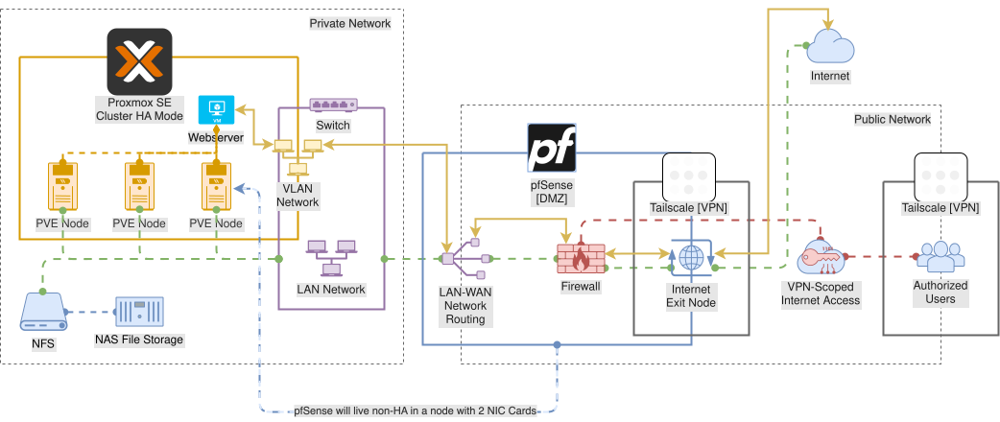

# papita-proxmox-lab

Hybrid **Proxmox VE** homelab with an **AWS** data plane: on-prem PVE nodes share **EFS** storage over **Tailscale**, while **pfSense** advertises the lab LAN to the tailnet for remote admin. Bash deploy scripts orchestrate node bootstrap, cluster operations, Tailscale ACLs, and (when restored) Terraform. **Cursor MCP servers** under [`mcp/`](./mcp/) expose structured Proxmox and pfSense APIs to AI agents.

Network diagram source: [`docs/Diagrams.drawio`](./docs/Diagrams.drawio) (export to `docs/Diagrams-Network.png` for a static image).

---

## Overview

| Concern             | Where it lives                                                                                                                                              | What it does                                                                                       |
| ------------------- | ----------------------------------------------------------------------------------------------------------------------------------------------------------- | -------------------------------------------------------------------------------------------------- |
| **Workstation CLI** | [`deploy/toolkit.sh`](./deploy/toolkit.sh)                                                                                                                  | Single entrypoint: Python dev tooling, Proxmox SSH deploy, Terraform wrapper, optional AWS SSO/MFA |
| **PVE bootstrap**   | [`src/bash/setup-pve-node.sh`](./src/bash/setup-pve-node.sh)                                                                                                | Interactive 17-step node setup (APT, WoL, sensors, hosts, Tailscale, hooks, backups, TLS)          |
| **Cluster ops**     | [`deploy/proxmox.sh`](./deploy/proxmox.sh)                                                                                                                  | SSH to nodes: `setup-node`, `get-temp`, `start-cluster`, `stop-cluster`                            |
| **Tailnet + LAN**   | [`deploy/tailscale-pfsense-lan.sh`](./deploy/tailscale-pfsense-lan.sh)                                                                                      | Approve pfSense routes, patch Tailscale ACLs, verify admin path to main PVE                        |
| **pfSense pfREST**  | [`deploy/pfsense-restapi-access.sh`](./deploy/pfsense-restapi-access.sh) · [`deploy/pfsense-firewall-tailscale.sh`](./deploy/pfsense-firewall-tailscale.sh) | Bootstrap REST API access and apply agreed Tailscale-tab firewall rules via pfREST                 |
| **Cursor MCP**      | [`mcp/`](./mcp/) · [`deploy/mcp.sh`](./deploy/mcp.sh)                                                                                                       | Install, test, and sync MCP servers for Proxmox VE and pfSense                                     |
| **AWS infra**       | [`terraform/plans/`](./terraform/plans/)                                                                                                                    | EFS + optional VPC (**in construction** — see [Terraform plans](./terraform/plans/README.md))      |
| **Runbooks**        | [`docs/TIPSNTRICKS.md`](./docs/TIPSNTRICKS.md)                                                                                                              | Ceph, cluster join, pfSense, Tailscale, VM clipboard, MCP smoke, maintenance                       |

**Lab topology (default):**

- **LAN:** `172.16.0.0/16` (gateway `172.16.0.1` on pfSense)
- **Main PVE admin node:** `172.16.0.101` (LAN + optional MagicDNS TLS on step 17)
- **Tailscale:** all PVE nodes join the tailnet for **EFS NFS**; pfSense is the **subnet router** for LAN; workers do not advertise routes
- **Remote admin:** reach Proxmox via pfSense subnet route and/or main-node Tailscale TLS — not worker `:8006` on the tailnet
- **AI agents (Cursor):** MCP over stdio to `proxmox-ve-mcp` (`:8006`) and `pfsense-mcp` (pfREST `:443`)

---

## Architecture

```text
                    ┌─────────────────────────────────────────┐
                    │  Workstation (this repo)                 │
                    │  deploy/toolkit.sh · deploy/mcp.sh       │
                    │  Cursor ──► proxmox-ve-mcp / pfsense-mcp │
                    └───────┬─────────────────┬───────────────┘
                            │                 │
              deploy/proxmox.sh     deploy/terraform.sh
                            │                 │
                            ▼                 ▼
              ┌─────────────────────┐   ┌──────────────────┐
              │  PVE cluster (on-prem)│   │  AWS             │
              │  • setup-pve-node.sh  │   │  EFS (NFS :2049) │
              │  • Tailscale client   │───┤  optional VPC    │
              │  • corosync / Ceph    │   │  (Terraform)     │
              └──────────┬────────────┘   └──────────────────┘
                         │
              ┌──────────▼────────────┐
              │  pfSense (Tailscale     │
              │  subnet router)         │
              │  advertises 172.16.0.0/16│
              │  pfREST :443 (MCP)      │
              └─────────────────────────┘
                         ▲
              deploy/tailscale-pfsense-lan.sh
              deploy/pfsense-* (pfREST bootstrap)
              (ACL + route approval from workstation)
```

**Data flow:** PVE nodes mount EFS over Tailscale (`100.64.0.0/10` allowed on EFS security groups). Management traffic between nodes uses the **LAN / corosync** network. Operators use the **main node** for UI and toolkit commands over LAN or tailnet paths documented in TIPSNTRICKS §9. **MCP servers** use the same tailnet/LAN paths with API tokens (Proxmox) or pfREST API keys (pfSense) — no SSH shell for agent reads.



---

## Repository layout

```text
papita-proxmox-lab/
├── deploy/                         # Run from repo root
│   ├── toolkit.sh                  # Main CLI
│   ├── proxmox.sh                  # SSH → PVE nodes
│   ├── terraform.sh                # Terraform init / workspace / plan|apply|destroy
│   ├── mcp.sh                      # Install / test / smoke / cursor-sync MCP servers
│   ├── tailscale-pfsense-lan.sh    # Tailscale API + pfSense LAN helper
│   ├── pfsense-restapi-access.sh   # pfREST Allowed Interfaces bootstrap
│   ├── pfsense-firewall-tailscale.sh # Tailscale-tab firewall rules via pfREST
│   ├── utils.sh / usage.sh         # Shared logging, prompts, help text
│   └── docs/                       # Usage manuals (less during setup prompts)
│       ├── setup-pve-node.usage.txt
│       └── tailscale-pfsense-lan.usage.txt
├── mcp/                            # Cursor MCP servers (Poetry path deps)
│   ├── README.md                   # Install guide for all MCP packages
│   ├── proxmox-ve-mcp/             # Proxmox VE REST — 21 tools (read + gated write)
│   └── pfsense-mcp/                # pfSense pfREST — 7 read-only tools + policy framework
├── src/
│   ├── bash/                       # Copied to /root/deploy on each PVE node
│   │   ├── setup-pve-node.sh       # 17-step interactive bootstrap
│   │   ├── post-startup-proc.sh / pre-shutdown-proc.sh
│   │   └── misc/tailscale/         # default tags, routes, LAN fallback lists
│   └── python/                     # Copied to /root/deploy/python on nodes
│       ├── misc/cluster/           # discover_hosts.py, domain_pattern.py (step 7)
│       └── datafiles/              # default.hosts.*, domain suffix lists
├── terraform/
│   ├── environments/               # Local only: config.{dev|prod|poc}.tfvars
│   └── plans/                      # Terraform root (see plans/README.md)
├── docs/
│   ├── TIPSNTRICKS.md              # Operational runbooks
│   └── Diagrams.drawio
├── pyproject.toml                  # Poetry workspace (MCP path deps + linters)
└── .pre-commit-config.yaml
```

**Not in git (local / secrets):** `terraform/environments/*.tfvars`, `.env`, `~/.cursor/mcp.json` (with real tokens), `.venv/`.

---

## Installation

### Workstation prerequisites

| Tool                            | Used for                                                                    |
| ------------------------------- | --------------------------------------------------------------------------- |
| **bash** 4+                     | All deploy scripts (`set -euo pipefail`)                                    |
| **Poetry** 2.x                  | Dev venv, MCP packages, linter tooling                                      |
| **Python** 3.11+                | MCP servers and pre-commit (3.14 in [`.python-version`](./.python-version)) |
| **jq**                          | Proxmox JSON (`pvesh`, cluster discovery, `mcp.json` merge)                 |
| **ssh**, **scp**                | `deploy/proxmox.sh`                                                         |
| **AWS CLI**                     | Terraform backend and providers (when plans exist)                          |
| **Terraform** `>= 1.6.5, < 2.0` | Via `deploy/terraform.sh` (when plans exist)                                |
| **pre-commit** (optional)       | `./deploy/toolkit.sh … --pre-commit` or local hooks                         |
| **Cursor** (optional)           | MCP client for `proxmox-ve` and `pfsense` servers                           |

### Clone and Python dev environment

```bash
git clone <repo-url> papita-proxmox-lab
cd papita-proxmox-lab

# In-project venv at .venv/ (includes mcp/* path dependencies)
poetry install --with pre-commit --with test
poetry run pre-commit install   # optional: git hooks
```

VS Code / Cursor: [`.vscode/settings.json`](./.vscode/settings.json) points the Python extension at `.venv` and adds `src/python` to analysis paths.

### MCP servers (Cursor)

```bash
chmod +x deploy/mcp.sh   # once
./deploy/mcp.sh install
./deploy/mcp.sh cursor-sync
# Edit ~/.cursor/mcp.json → set PVE_TOKEN_SECRET, PFSENSE_API_KEY, hosts as needed
./deploy/mcp.sh smoke --server proxmox-ve-mcp
./deploy/mcp.sh smoke --server pfsense-mcp
```

Reload **Cursor** after `cursor-sync`. Full guide: [`mcp/README.md`](./mcp/README.md).

### PVE node prerequisites

Nodes are prepared by **`setup-node`** (or run [`src/bash/setup-pve-node.sh`](./src/bash/setup-pve-node.sh) locally on the node). Step 1 installs packages from [`src/bash/apt-dependencies.list`](./src/bash/apt-dependencies.list) (`jq`, `lm-sensors`, `chrony`, `smartmontools`, `postfix`, `python3`, …).

---

## Configuration

### Environment file (Tailscale + lab LAN)

Copy [`.env.example`](./.env.example) to `.env` (gitignored):

```bash
cp .env.example .env
# Edit: TAILSCALE_API_KEY, TAILSCALE_TAILNET, LAN_CIDR, MAIN_PVE_LAN_IP, …
```

Used by `deploy/tailscale-pfsense-lan.sh` and as optional **Tailscale Admin API** fallback for pfSense MCP smoke (`tailscale_subnet_route` check). Load via toolkit:

```bash
./deploy/toolkit.sh proxmox -e dev --env-file .env -ip 172.16.0.101 -pa setup-node
```

### Cursor MCP (`~/.cursor/mcp.json`)

`./deploy/mcp.sh cursor-sync` merges each package's `mcp.json.example` into your Cursor config (preserves existing `env` secrets). Set **`cwd`** to the **repo root** so Poetry reuses `.venv/`.

| Server id    | Package          | Key variables                                                                         |
| ------------ | ---------------- | ------------------------------------------------------------------------------------- |
| `proxmox-ve` | `proxmox-ve-mcp` | `PVE_HOST`, `PVE_API_TOKEN` or split `PVE_USER` / `PVE_TOKEN_ID` / `PVE_TOKEN_SECRET` |
| `pfsense`    | `pfsense-mcp`    | `PFSENSE_HOST` (IPv4/IPv6 only), `PFSENSE_API_KEY`, optional `PFSENSE_LOG_LEVEL`      |

Setup guides: [proxmox-ve-mcp/docs/PVE_TOKEN_SETUP.md](./mcp/proxmox-ve-mcp/docs/PVE_TOKEN_SETUP.md), [pfsense-mcp/docs/PFSENSE_API_KEY_SETUP.md](./mcp/pfsense-mcp/docs/PFSENSE_API_KEY_SETUP.md).

### Terraform variables (per environment)

Create **local** files (never commit):

```text
terraform/environments/config.dev.tfvars
terraform/environments/config.prod.tfvars
terraform/environments/config.poc.tfvars
```

Required keys for `deploy/terraform.sh`: `tf_backend_bucket`, `tf_backend_key`, `region`, plus root module variables — see [`terraform/plans/README.md`](./terraform/plans/README.md) for a full skeleton.

### SSH to PVE

- **User:** `root` (default)
- **Auth:** SSH keys preferred; optional `PAPITA_SSH_PASSWORD` or `SSH_CLUSTER_PASSWORD` for scripted peer access (`get-temp`, etc.)
- **Remote bundle path:** `/root/deploy` (contents of `src/bash/`, `src/python/`, plus copied `utils.sh`, `usage.sh`, `docs/setup-pve-node.usage.txt`)

---

## Usage

All deploy commands assume the **repository root** as the current working directory.

### Toolkit (main entrypoint)

```bash
./deploy/toolkit.sh ACTION -e {dev|prod} [OPTIONS]
```

| Action                           | Description                                                |
| -------------------------------- | ---------------------------------------------------------- |
| `build`                          | Build wheels from `libs/` → `dist/` (when `libs/` exists)  |
| `devsync`                        | `build` + pip install wheels into the active env           |
| `test`                           | `build` + pytest with coverage (when `tests/` exists)      |
| `proxmox` / `deploy_proxmox`     | Delegate to [`deploy/proxmox.sh`](./deploy/proxmox.sh)     |
| `terraform` / `deploy_terraform` | Delegate to [`deploy/terraform.sh`](./deploy/terraform.sh) |
| `none`                           | No-op; useful with `--pre-commit` only                     |

Common flags: `--env-file`, `--aws-sso` / `--aws-mfa`, `--pre-commit`, `--proxmox-action`, `--terraform-action`, `--ip-address`, `--hostname`, `--profile`, `--region`.

```bash
# Full help
./deploy/toolkit.sh -h

# Bootstrap a node (interactive TTY over SSH)
./deploy/toolkit.sh proxmox -e dev -ip 172.16.0.102 -pa setup-node

# Cluster temperatures (requires lm-sensors / step 5 on nodes)
./deploy/toolkit.sh proxmox -e dev -ip 172.16.0.101 -pa get-temp

# Terraform plan (when .tf sources exist)
./deploy/toolkit.sh terraform -e dev -ta plan --aws-sso
```

### MCP servers (`deploy/mcp.sh`)

| Action        | Description                                                                 |
| ------------- | --------------------------------------------------------------------------- |
| `list`        | Show packages under `mcp/` and Cursor server ids                            |
| `install`     | `poetry install --with test`; register MCP console scripts                  |
| `update`      | Same as `install` — run after `git pull`                                    |
| `test`        | `pytest` for all MCP test suites                                            |
| `smoke`       | Live connectivity smoke (loads credentials from `~/.cursor/mcp.json`)       |
| `cursor-sync` | Merge `mcp.json.example` into `~/.cursor/mcp.json` (keeps existing secrets) |

```bash
./deploy/mcp.sh install
./deploy/mcp.sh cursor-sync
./deploy/mcp.sh smoke --server proxmox-ve-mcp              # 6 basic checks
./deploy/mcp.sh smoke --server proxmox-ve-mcp --extended   # 13 checks (guests, storage, Ceph)
./deploy/mcp.sh smoke --server pfsense-mcp                 # 9 checks (core + lab policy)
```

| Package            | Tools | Console scripts (examples)                                                          |
| ------------------ | ----- | ----------------------------------------------------------------------------------- |
| **proxmox-ve-mcp** | 21    | `proxmox-ve-mcp`, `proxmox-ve-mcp-smoke`                                            |
| **pfsense-mcp**    | 7     | `pfsense-mcp`, `pfsense-mcp-smoke`, `pfsense-mcp-bootstrap`, `pfsense-mcp-firewall` |

In Cursor, call **`pve_run_smoke_tests`** or **`pfs_run_smoke_tests`** after install. Package READMEs: [`mcp/proxmox-ve-mcp/README.md`](./mcp/proxmox-ve-mcp/README.md), [`mcp/pfsense-mcp/README.md`](./mcp/pfsense-mcp/README.md).

### pfSense pfREST helpers

These scripts load `PFSENSE_*` from `~/.cursor/mcp.json` (via `cursor-sync`):

```bash
./deploy/pfsense-restapi-access.sh fix-access    # clear Allowed Interfaces (Tailscale path)
./deploy/pfsense-restapi-access.sh probe-version # connectivity check
./deploy/pfsense-firewall-tailscale.sh apply     # Tailscale-tab AUTH_CLIENTS rules + smoke
./deploy/pfsense-firewall-tailscale.sh apply --dry-run
```

Policy reference: [pfsense-mcp/docs/POLICY.md](./mcp/pfsense-mcp/docs/POLICY.md). WebGUI checklist: `./deploy/tailscale-pfsense-lan.sh pfsense-steps`.

### Proxmox (`deploy/proxmox.sh`)

| Action                         | Purpose                                                |
| ------------------------------ | ------------------------------------------------------ |
| `setup-node`                   | Replace remote `/root/deploy`, run `setup-pve-node.sh` |
| `get-temp`                     | Cluster-wide `sensors -j` table                        |
| `start-cluster`                | WoL peer nodes via `pvenode wakeonlan`                 |
| `stop-cluster`                 | `pvesh stopall` + shutdown per node                    |
| `cluster-nodes` / `local-node` | Discovery helpers                                      |

```bash
./deploy/proxmox.sh setup-node --ip-address 172.16.0.101
./deploy/proxmox.sh get-temp --ip-address 172.16.0.101
./deploy/proxmox.sh start-cluster --ip-address 172.16.0.101
```

Manual for setup prompts: [`deploy/docs/setup-pve-node.usage.txt`](./deploy/docs/setup-pve-node.usage.txt).

### PVE setup steps (`setup-pve-node.sh`)

Controlled by `PVE_SETUP_LAST_STEP=17`. At the first prompt, enter `y`, `n`, a step number `1`–`17`, or `h`/`help` for the full manual.

| Step | Topic                                                                         |
| ---- | ----------------------------------------------------------------------------- |
| 1    | APT, dependencies, unattended-upgrades, upgrade cron, optional microcode      |
| 2    | Hibernate / sleep off (WoL-friendly poweroff)                                 |
| 3    | Wake-on-LAN                                                                   |
| 4    | Locales                                                                       |
| 5    | lm-sensors (enables `get-temp`)                                               |
| 6    | chrony NTP                                                                    |
| 7    | `/etc/hosts` cluster peers via DNS (`discover_hosts.py`) — **before `pvecm`** |
| 8    | Tailscale install, sysctl, optional `cluster.fw`, optional NAT                |
| 9    | `tailscale up` (main vs worker route policy)                                  |
| 10   | Post-startup systemd (quorum wait, Ceph noout unset, main-node WoL)           |
| 11   | Pre-shutdown systemd (optional `pvesh stopall`, Ceph noout)                   |
| 12   | Email (postfix + Proxmox mailto)                                              |
| 13   | SMART monitoring cron                                                         |
| 14   | Enable Proxmox cluster firewall                                               |
| 15   | Remove PVE subscription nag                                                   |
| 16   | vzdump backup cron                                                            |
| 17   | Tailscale TLS cert for UI `:8006` (**main node only**)                        |

### Tailscale + pfSense LAN

```bash
export TAILSCALE_API_KEY='tskey-api-...'
export TAILSCALE_TAILNET='your-tailnet.ts.net'
./deploy/tailscale-pfsense-lan.sh configure          # routes + ACL + verify
./deploy/tailscale-pfsense-lan.sh verify             # local checks only
./deploy/tailscale-pfsense-lan.sh pfsense-steps      # WebGUI checklist
```

Actions: `configure`, `approve-routes`, `patch-acl`, `verify`, `pfsense-steps`. Manual: [`deploy/docs/tailscale-pfsense-lan.usage.txt`](./deploy/docs/tailscale-pfsense-lan.usage.txt).

### Terraform

> **Status:** Plans under [`terraform/plans/`](./terraform/plans/) are **in construction**. `deploy/terraform.sh` remains wired for the previous layout; restore or rewrite `.tf` files before running apply.

When available:

```bash
./deploy/terraform.sh plan   -e dev
./deploy/terraform.sh apply  -e dev
./deploy/terraform.sh destroy -e dev
```

Flow: read `terraform/environments/config.<env>.tfvars` → `terraform init` (S3 backend) → workspace `papita-proxmox-lab-<env>` → action. Details: [`terraform/plans/README.md`](./terraform/plans/README.md).

---

## Python tooling

| Component                                                                                  | Role                                                   |
| ------------------------------------------------------------------------------------------ | ------------------------------------------------------ |
| [`mcp/proxmox-ve-mcp/`](./mcp/proxmox-ve-mcp/)                                             | Proxmox VE MCP server (FastMCP, httpx, Pydantic)       |
| [`mcp/pfsense-mcp/`](./mcp/pfsense-mcp/)                                                   | pfSense pfREST MCP server + lab policy framework       |
| [`src/python/misc/cluster/discover_hosts.py`](./src/python/misc/cluster/discover_hosts.py) | Step 7: DNS peer discovery → `/etc/hosts` lines        |
| [`src/python/misc/cluster/domain_pattern.py`](./src/python/misc/cluster/domain_pattern.py) | Wildcard domain suffix expansion (`oldtimers.*`, etc.) |
| [`src/python/datafiles/`](./src/python/datafiles/)                                         | Default host lists, regex, domain suffix labels        |

On PVE nodes, Python is **runtime-only** (no Poetry). On the workstation, Poetry manages MCP packages as **path dependencies** and dev linters (black, isort, flake8, pylint, mypy, interrogate) via [`pyproject.toml`](./pyproject.toml) and [`.pre-commit-config.yaml`](./.pre-commit-config.yaml).

```bash
poetry run pre-commit run --all-files
poetry run pytest mcp/proxmox-ve-mcp/tests/ mcp/pfsense-mcp/tests/
./deploy/mcp.sh test
# or
./deploy/toolkit.sh none -e dev --pre-commit
```

Both MCP packages emit **structured JSON logs on stderr** (`PVE_LOG_LEVEL` / `PFSENSE_LOG_LEVEL`); stdout stays free for MCP stdio protocol traffic.

---

## Development

| Task                    | Command                                                                                                                                          |
| ----------------------- | ------------------------------------------------------------------------------------------------------------------------------------------------ |
| Install dev deps        | `poetry install --with pre-commit --with test`                                                                                                   |
| Run linters             | `poetry run pre-commit run --all-files`                                                                                                          |
| MCP unit tests          | `./deploy/mcp.sh test` or `poetry run pytest mcp/*/tests/`                                                                                       |
| MCP live smoke          | `./deploy/mcp.sh smoke --server proxmox-ve-mcp` / `pfsense-mcp`                                                                                  |
| Shell conventions       | `set -euo pipefail`; source `deploy/utils.sh` + `deploy/usage.sh` before `log`                                                                   |
| Adding a PVE setup step | Bump `PVE_SETUP_LAST_STEP`, add `_skip_pve_step`, update menu + [`deploy/docs/setup-pve-node.usage.txt`](./deploy/docs/setup-pve-node.usage.txt) |
| Adding an MCP package   | Create `mcp/<name>-mcp/`, add path dep to root `pyproject.toml`, document in [`mcp/README.md`](./mcp/README.md)                                  |
| Terraform edits         | Under `terraform/plans/`; env values in untracked tfvars only                                                                                    |

**Secrets:** never commit `*.tfvars`, `.env`, API tokens, Tailscale keys, or `~/.cursor/mcp.json` with real credentials (see [`.gitignore`](./.gitignore)).

---

## Documentation index

| Document                                                                        | Contents                                                                      |
| ------------------------------------------------------------------------------- | ----------------------------------------------------------------------------- |
| [**MCP install guide**](./mcp/README.md)                                        | `deploy/mcp.sh`, Cursor sync, smoke tests, both packages                      |
| [**Proxmox VE MCP**](./mcp/proxmox-ve-mcp/README.md)                            | 21 tools, token setup, smoke catalog, requirements                            |
| [**pfSense MCP**](./mcp/pfsense-mcp/README.md)                                  | 7 read tools, pfREST setup, policy framework                                  |
| [**pfSense lab policy**](./mcp/pfsense-mcp/docs/POLICY.md)                      | Tailscale firewall, REST API access, endpoint privilege domains               |
| [**Proxmox Tips & Tricks**](./docs/TIPSNTRICKS.md)                              | Ceph, cluster destroy/join, corosync, pfSense, Tailscale ACLs, MCP, Fedora VM |
| [**PVE setup manual**](./deploy/docs/setup-pve-node.usage.txt)                  | Full 17-step reference (shown in `less` during setup)                         |
| [**Tailscale / pfSense manual**](./deploy/docs/tailscale-pfsense-lan.usage.txt) | ACL grants, verify, pfSense checklist                                         |
| [**Terraform plans**](./terraform/plans/README.md)                              | AWS module design, tfvars, workspace flow, restore notes                      |
| [**Network diagram**](./docs/Diagrams.drawio)                                   | Editable architecture (draw.io)                                               |

---

## Project status

| Area                                 | State                                                           |
| ------------------------------------ | --------------------------------------------------------------- |
| PVE bootstrap + cluster scripts      | Active (`setup-pve-node.sh`, `proxmox.sh`)                      |
| Tailscale / pfSense automation       | Active (`tailscale-pfsense-lan.sh`, `pfsense-*` pfREST helpers) |
| **Cursor MCP — Proxmox VE**          | Active (`proxmox-ve-mcp` v0.1.0a5 — read + gated write)         |
| **Cursor MCP — pfSense**             | Active (`pfsense-mcp` v0.1.0a1 — read-only + lab policy verify) |
| Terraform AWS stack                  | **In construction** — `.tf` removed; README + wrapper remain    |
| Legacy Python app packages (`libs/`) | Referenced by toolkit; not in repository                        |

---

## License

See [LICENSE](./LICENSE).
