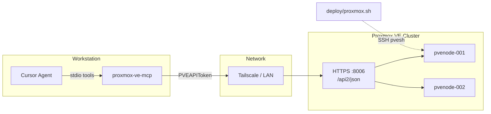

# Proxmox VE MCP Server

**`proxmox-ve-mcp`** v0.1.0a5 — a [Model Context Protocol](https://modelcontextprotocol.io/) server that lets AI agents in Cursor inspect and safely operate a **Proxmox VE** cluster over HTTPS `:8006`, using scoped **PVE API tokens** instead of ad-hoc SSH shell commands.

Tested against **Proxmox VE 8.x**. Part of the [papita-proxmox-lab](https://github.com/Elmorralito/papita-proxmox-lab) hybrid Proxmox + AWS lab.

---

## Overview

This package exposes 21 typed MCP tools (18 read, 3 write) that map to the Proxmox REST API at `/api2/json`. It complements — but does not replace — existing Bash automation in [`deploy/proxmox.sh`](../../deploy/proxmox.sh) and operational runbooks in [`docs/TIPSNTRICKS.md`](../../docs/TIPSNTRICKS.md).

| Sprint phase                                             | Status  |
| -------------------------------------------------------- | ------- |
| Foundation + read core (Sprint 0–1)                      | Done    |
| Read extended (Sprint 2)                                 | Done    |
| Write gated (Sprint 3)                                   | Done    |
| Polish — traceability, integration flag, docs (Sprint 4) | Partial |

For requirement IDs, acceptance criteria, and code evidence, see [REQUIREMENTS.md](./REQUIREMENTS.md).

---

## Problem & motivation

The lab already automates Proxmox via Bash over SSH (`pvesh`, `pvecm`, `pvenode`, `ceph`). That works for operators, but creates friction for AI agents:

| Gap today                                   | What MCP provides                                                                              |
| ------------------------------------------- | ---------------------------------------------------------------------------------------------- |
| Unstructured SSH output                     | JSON responses with predictable `ok`, `data`, `warnings`, and `meta` fields                    |
| Password / 2FA on SSH sessions              | Revocable API tokens (`PVEAPIToken=…`) with least-privilege roles                              |
| Agent invokes wrong commands on wrong nodes | Single `PVE_HOST` entry point; explicit `node` parameter on multi-node calls                   |
| Accidental destructive operations           | Every tool classified as `read`, `write`, or `destructive`; write tools require `confirm=true` |
| Poor discoverability                        | Tool docstrings and `meta.runbook_ref` point to repo runbooks                                  |

Agents get structured cluster state and gated guest power operations. Operators keep Bash for workflows with no REST equivalent (WoL, sensors, node bootstrap, Ceph CLI mutations).

---

## Where this fits in papita-proxmox-lab

```text
Workstation (Cursor / deploy scripts)
    │
    ├── MCP stdio ──► proxmox-ve-mcp ──► HTTPS :8006 ──► PVE REST API
    │                                      (Tailscale MagicDNS or LAN)
    │
    └── SSH :22 ──► deploy/proxmox.sh ──► pvesh / pvecm / pvenode / ceph / sensors
                                          (on-node CLI, ControlMaster multiplex)
```

Access is typically over **Tailscale** to any online cluster member on port **8006** (TLS cert from `setup-pve-node.sh` step 17). The MCP server uses one entry host (`PVE_HOST`); multi-node operations pass an explicit `node` argument.



---

## Architecture

### Request flow

1. Cursor invokes an MCP tool over **stdio**.
2. `server.py` routes to a registered tool in `tools/register.py`.
3. Input is validated with **Pydantic** models (`tools/schemas.py`).
4. The tool calls the shared **`PveClient`** (`client/http.py`) — async **httpx** with token auth, TLS verification, and a concurrency semaphore (max 4 in-flight requests).
5. The response is shaped as JSON with metadata: `tool_class`, `duration_ms`, optional `runbook_ref`, and warnings where applicable.
6. Mutating tools log structured audit events to **stderr** (tool name, node, vmid, outcome — never secrets).

```mermaid
flowchart TB
    subgraph mcp_pkg [proxmox_ve_mcp]
        S[server.py — FastMCP stdio]
        R[tools/register.py]
        T[tools/cluster|nodes|guests|storage|ceph]
        RESP[tools/response.py]
        C[client/http.py]
        CFG[config.py — PveSettings]
        CTX[context.py — client singleton]
    end

    Cursor -->|stdio| S
    S --> R
    R --> T
    T --> RESP
    T --> C
    CFG --> CTX
    CTX --> C
    C -->|HTTPS PVEAPIToken| PVE[PVE :8006 /api2/json]
```

### Component map

| Module              | Responsibility                                                                |
| ------------------- | ----------------------------------------------------------------------------- |
| `server.py`         | MCP entry point; loads config, initializes context, runs stdio transport      |
| `config.py`         | `PveSettings` — `PVE_HOST`, token fields, TLS flag; fail-fast on missing auth |
| `context.py`        | Process-wide `PveClient` singleton                                            |
| `client/http.py`    | Async GET/POST to `/api2/json`; semaphore-limited concurrency                 |
| `client/errors.py`  | `PveApiError` with HTTP status and PVE error body                             |
| `client/tasks.py`   | UPID polling for async write operations                                       |
| `tools/register.py` | Registers all MCP tools; tracks `ToolClass` per tool                          |
| `tools/registry.py` | `ToolClass` enum: `read` \| `write` \| `destructive`                          |
| `tools/schemas.py`  | Pydantic input/output models; `ConfirmWriteInput` for writes                  |
| `tools/response.py` | Standard JSON envelope; `@tool_handler` / `@write_tool_handler` decorators    |
| `tools/meta.py`     | Builds `meta` block with `tool_class` and `runbook_ref`                       |
| `tools/helpers.py`  | Secret redaction, `require_confirm()`, node/guest validation                  |
| `tools/cluster.py`  | Cluster introspection tools (nodes, health, tasks, resources)                 |
| `tools/nodes.py`    | Node status and guest inventory                                               |
| `tools/guests.py`   | Guest config read + gated start/shutdown/stopall                              |
| `tools/storage.py`  | Storage definitions and per-node capacity                                     |
| `tools/ceph.py`     | Ceph health and OSD list (read-only)                                          |
| `constants.py`      | API prefix, runbook pointers, `BASH_ONLY_WORKFLOWS`                           |
| `logging_config.py` | JSON structured logs to stderr                                                |

### Layer rules

1. **Tools** are thin: validate input → call client → return JSON string.
2. **Client** has no MCP imports — reusable for a future CLI.
3. **Config** loads once at startup; missing `PVE_HOST` or token fails immediately.

### Safety model

| Class           | v1 behavior                                                    |
| --------------- | -------------------------------------------------------------- |
| **Read**        | GET-only API calls; no confirmation required                   |
| **Write**       | POST with mandatory `confirm=true`; audit log on stderr        |
| **Destructive** | Registered in `ToolClass` but **zero destructive tools in v1** |

Additional safeguards:

- Guest config responses redact passwords, SSH keys, and cloud-init secrets.
- Write tools optionally wait for UPID completion via `client/tasks.py`.
- Server logs host and port at startup — never the token.

---

## MCP tools

### Read (18)

| Tool                           | Purpose                                                   | Lab workflow                                    |
| ------------------------------ | --------------------------------------------------------- | ----------------------------------------------- |
| `pve_get_version`              | API smoke test; validates token and TLS                   | —                                               |
| `pve_check_token`              | Permission probe matrix; run when tools return HTTP 403   | [PVE_TOKEN_SETUP.md](./docs/PVE_TOKEN_SETUP.md) |
| `pve_run_smoke_tests`          | **Post-install suite** — connectivity, auth, access level | [SMOKE_TESTS.md](./docs/SMOKE_TESTS.md)         |
| `pve_list_node_addresses`      | Corosync `ring0_addr` + interface IPs per node            | `deploy/proxmox.sh local-node`                  |
| `pve_list_nodes`               | Cluster members with online/offline status                | `deploy/proxmox.sh cluster-nodes`               |
| `pve_get_cluster_config_nodes` | Node config including `ring0_addr`                        | `deploy/proxmox.sh local-node`                  |
| `pve_get_cluster_options`      | Datacenter options (mailto, mailfrom, …)                  | `setup-pve-node.sh` step 12                     |
| `pve_list_tasks`               | Cluster tasks with optional filter and pagination         | TIPSNTRICKS troubleshooting                     |
| `pve_get_task_log`             | Task log for a UPID on a node                             | Async operation follow-up                       |
| `pve_list_resources`           | VMs, CTs, storage, pools — filterable                     | TIPSNTRICKS cluster verify                      |
| `pve_cluster_health`           | Derived online/offline summary + quorum hint              | TIPSNTRICKS cluster verify                      |
| `pve_get_node_status`          | CPU, memory, uptime for a node                            | Capacity checks                                 |
| `pve_list_guests`              | VM and CT inventory (`guest_type`: qemu/lxc)              | —                                               |
| `pve_get_guest_status`         | Runtime status for one guest                              | —                                               |
| `pve_get_guest_config`         | Guest config with secrets redacted                        | —                                               |
| `pve_list_storage`             | Storage definitions; pass `node` for capacity             | TIPSNTRICKS `pvesm status`                      |
| `pve_get_ceph_status`          | Ceph health summary (read-only)                           | TIPSNTRICKS OSD Storage                         |
| `pve_list_ceph_osds`           | OSD list on a node (read-only)                            | TIPSNTRICKS OSD Storage                         |

Many responses include `meta.runbook_ref` pointing to the relevant repo path (see `constants.RUNBOOK_REFS`).

### Write (3 — require `confirm=true`)

| Tool                 | Purpose                   | Lab workflow                                             |
| -------------------- | ------------------------- | -------------------------------------------------------- |
| `pve_start_guest`    | Start a VM or CT          | Verify target with read tools first                      |
| `pve_shutdown_guest` | ACPI shutdown             | `pre-shutdown-proc.sh` graceful path                     |
| `pve_stopall_guests` | Stop all guests on a node | `pre-shutdown-proc.sh` — pair with Ceph `noout` manually |

Write tools return a UPID; set `wait_for_completion=true` to poll task status.

### Response shape

```json
{
  "ok": true,
  "data": {},
  "warnings": ["Approximate quorum only — no pvecm in v1"],
  "meta": {
    "tool": "pve_cluster_health",
    "tool_class": "read",
    "duration_ms": 142,
    "runbook_ref": "docs/TIPSNTRICKS.md — verify communication between cluster nodes"
  }
}
```

---

## Out of scope (v1)

These workflows stay in Bash or manual runbooks. The MCP surfaces them in `BASH_ONLY_WORKFLOWS` (returned by `pve_cluster_health`) so agents know where to look:

| Workflow                                      | Use instead                                     |
| --------------------------------------------- | ----------------------------------------------- |
| Node bootstrap                                | `deploy/proxmox.sh setup-node`                  |
| Cluster temperature                           | `deploy/proxmox.sh get-temp`                    |
| Wake-on-LAN cluster start                     | `deploy/proxmox.sh start-cluster`               |
| Full cluster shutdown (node hypervisor)       | `deploy/proxmox.sh stop-cluster`                |
| Ceph `noout` set/unset                        | `pre-shutdown-proc.sh` / `post-startup-proc.sh` |
| Ceph OSD startup / mutations                  | `docs/TIPSNTRICKS.md` § OSD Storage (manual)    |
| Terraform / AWS provisioning                  | `deploy/terraform.sh`                           |
| Node removal, corosync edits, storage destroy | Manual / TIPSNTRICKS runbooks                   |

Deferred to **v2**: SSH proxy tool, hard guest stop, migration, MCP resources for TIPSNTRICKS sections, true quorum via `pvecm`.

---

## Configuration

### Environment variables

| Variable           | Required | Default | Description                                                  |
| ------------------ | -------- | ------- | ------------------------------------------------------------ |
| `PVE_HOST`         | Yes      | —       | Any online cluster member (hostname or IP, no scheme)        |
| `PVE_PORT`         | No       | `8006`  | Proxmox API port                                             |
| `PVE_USER`         | Yes\*    | —       | API user, e.g. `mcp-agent@pam`                               |
| `PVE_TOKEN_ID`     | Yes\*    | —       | Token identifier, e.g. `mcp-cursor`                          |
| `PVE_TOKEN_SECRET` | Yes\*    | —       | Token secret (shown once at creation)                        |
| `PVE_API_TOKEN`    | Yes\*    | —       | Alternative: full `USER@REALM!TOKENID=SECRET` string         |
| `PVE_VERIFY_SSL`   | No       | `true`  | Set `false` only for default self-signed cert before step 17 |
| `PVE_LOG_LEVEL`    | No       | `INFO`  | stderr JSON log level: `DEBUG`, `INFO`, `WARNING`, `ERROR`   |
| `PVE_INTEGRATION`  | No       | —       | Set to `1` to run live-cluster integration tests             |

\* Provide either `PVE_API_TOKEN` or all three split fields.

**Cursor (preferred):** supply variables in `mcp.json` `env` — no `.env` file required.

**CLI:** copy [`.env.example`](./.env.example) to `.env` or export variables manually.

Token creation and least-privilege roles: [docs/PVE_TOKEN_SETUP.md](./docs/PVE_TOKEN_SETUP.md).

### Cursor MCP

Add to your Cursor MCP config (adapt paths and secrets):

```json
{
  "mcpServers": {
    "proxmox-ve": {
      "command": "poetry",
      "args": ["run", "proxmox-ve-mcp"],
      "cwd": "/absolute/path/to/papita-proxmox-lab/mcp/proxmox-ve-mcp",
      "env": {
        "PVE_HOST": "pvenode-001.your-tailnet.ts.net",
        "PVE_PORT": "8006",
        "PVE_USER": "mcp-agent@pam",
        "PVE_TOKEN_ID": "mcp-cursor",
        "PVE_TOKEN_SECRET": "REPLACE_FROM_SECRET_STORE",
        "PVE_VERIFY_SSL": "true"
      }
    }
  }
}
```

See [mcp.json.example](./mcp.json.example) for the full template.

---

## Quick start

### Install / update (recommended)

From the repo root:

```bash
./deploy/mcp.sh install
./deploy/mcp.sh cursor-sync   # merge into ~/.cursor/mcp.json; edit PVE_TOKEN_SECRET
./deploy/mcp.sh smoke --extended
```

See [../mcp/README.md](../mcp/README.md) and `./deploy/mcp.sh --help`.

### From the MCP package directory

```bash
cd mcp/proxmox-ve-mcp
poetry install
poetry run proxmox-ve-mcp
```

### From the repo root

The root [`pyproject.toml`](../../pyproject.toml) includes `proxmox-ve-mcp` as a path dependency:

```bash
cd /path/to/papita-proxmox-lab
poetry install --with test
poetry run pytest mcp/proxmox-ve-mcp/tests
```

### Post-install smoke tests

After configuring MCP, run the optional smoke test suite to verify connectivity and token access level.

**MCP tool:** `pve_run_smoke_tests` (pass `extended=true` for the full read matrix)

**CLI:**

```bash
cd /path/to/papita-proxmox-lab
poetry run proxmox-ve-mcp-smoke              # basic (6 tests)
poetry run proxmox-ve-mcp-smoke --extended   # full (13 tests)
poetry run proxmox-ve-mcp-smoke --json       # machine-readable report
```

See [SMOKE_TESTS.md](./docs/SMOKE_TESTS.md) for the full test catalog, access levels, and failure fixes.

### Cursor smoke test (manual)

After configuring MCP (set `cwd` to **repo root** — see [mcp.json.example](./mcp.json.example)):

1. Call **`pve_run_smoke_tests`** — recommended single post-install check.
2. Or step through: `pve_get_version` → `pve_check_token` → `pve_list_nodes` → `pve_list_node_addresses`.

### Troubleshooting

| Symptom                               | Likely cause                    | Fix                                                                                                          |
| ------------------------------------- | ------------------------------- | ------------------------------------------------------------------------------------------------------------ |
| MCP not visible to agent              | Cursor not reloaded             | Restart Cursor; Settings → MCP → `proxmox-ve` green                                                          |
| HTTP 403 on cluster config / network  | Token ACL missing `Sys.Audit`   | Run `pve_check_token`; assign role to **token** at `/` — see [PVE_TOKEN_SETUP.md](./docs/PVE_TOKEN_SETUP.md) |
| `root@pam` still gets 403             | Privilege separation on token   | Token permissions ≠ user permissions                                                                         |
| Poetry rebuilds venv each run         | `cwd` points at MCP subdir only | Set `cwd` to repo root in `mcp.json`                                                                         |
| `ModuleNotFoundError: proxmox_ve_mcp` | Package not installed in venv   | `poetry install` from repo root                                                                              |

403 errors include a `hint` field with the missing privilege (e.g. `Sys.Audit`) and setup doc link.

---

## Development & testing

| Task                             | Command                                                                                        |
| -------------------------------- | ---------------------------------------------------------------------------------------------- |
| Unit tests (mocked API)          | `poetry run pytest` from repo root or MCP directory                                            |
| Integration tests (live cluster) | `PVE_INTEGRATION=1 poetry run pytest -k integration`                                           |
| Run MCP server locally           | `poetry run proxmox-ve-mcp`                                                                    |
| Post-install smoke tests         | `poetry run proxmox-ve-mcp-smoke [--extended]`                                                 |
| Lint / format                    | Repo root [`pyproject.toml`](../../pyproject.toml) — black, isort, mypy, flake8 via pre-commit |

Tests use **pytest** + **respx** to mock Proxmox HTTP responses. Compliance checks live in `tests/test_requirements_compliance.py`.

Requires **Python 3.11+** (`requires-python = ">=3.11,<4"`).

---

## Limitations & known gaps

| Item                                    | Status    | Notes                                                       |
| --------------------------------------- | --------- | ----------------------------------------------------------- |
| Quorum detection (`pve_cluster_health`) | Partial   | Approximates from node online counts; no `pvecm` in v1      |
| WoL, sensors, Ceph mutations            | By design | No REST equivalent or intentionally excluded                |
| `stop-cluster` parity                   | Partial   | MCP covers guest stopall only; node shutdown stays in Bash  |
| MCP resources for TIPSNTRICKS           | v2        | Runbook hints in docstrings and `meta.runbook_ref` for now  |
| Pre-commit wired for MCP path           | Partial   | Root pre-commit covers Python; dedicated path hook optional |

See [REQUIREMENTS.md](./REQUIREMENTS.md) for the full requirement and traceability matrix.

---

## Implementation

v1 was delivered in four sprints. Higher tiers blocked lower tiers.

### Priority tiers

| Tier   | Label         | Sprint | Outcome                                                                                |
| ------ | ------------- | ------ | -------------------------------------------------------------------------------------- |
| **P0** | Foundation    | 0      | Runnable stdio MCP server, HTTP client, config, `ToolClass` registry                   |
| **P1** | Read core     | 1      | Cluster nodes, health, resources, guests, storage — replaces basic SSH troubleshooting |
| **P2** | Read extended | 2      | Tasks, guest config, Ceph read, runbook refs                                           |
| **P3** | Write gated   | 3      | start/shutdown/stopall with `confirm` + audit logging                                  |
| **P4** | Polish        | 4      | Tests, `.env.example`, `mcp.json`, token docs (partial)                                |

### Sprint deliverables

| Sprint | Tools / deliverables                                                                                                                                                                 | Exit criteria                                               |
| ------ | ------------------------------------------------------------------------------------------------------------------------------------------------------------------------------------ | ----------------------------------------------------------- |
| **0**  | `pve_get_version`, `pve_list_nodes`; `config.py`, `client/http.py`, `server.py`                                                                                                      | MCP starts; Cursor lists tools                              |
| **1**  | `pve_cluster_health`, `pve_list_resources`, `pve_get_node_status`, `pve_list_guests`, `pve_get_guest_status`, `pve_list_storage`                                                     | Agent answers “nodes online?”, “VMs down?”, “storage full?” |
| **2**  | `pve_get_cluster_config_nodes`, `pve_get_cluster_options`, `pve_list_tasks`, `pve_get_task_log`, `pve_get_guest_config`, `pve_get_ceph_status`, `pve_list_ceph_osds`, `RUNBOOK_REFS` | Full introspection + Ceph read                              |
| **3**  | `pve_start_guest`, `pve_shutdown_guest`, `pve_stopall_guests`; `client/tasks.py`                                                                                                     | Writes reject missing `confirm`; audit on stderr            |
| **4**  | pytest/respx suite, integration flag, docs                                                                                                                                           | `poetry run pytest` green                                   |

### Package layout

```text
mcp/proxmox-ve-mcp/
├── pyproject.toml
├── README.md
├── REQUIREMENTS.md             # Spec + traceability
├── .env.example
├── mcp.json.example
├── docs/PVE_TOKEN_SETUP.md
├── docs/UTILITY_API_CALLS.md
├── src/proxmox_ve_mcp/
│   ├── server.py               # MCP entry, stdio
│   ├── config.py               # PveSettings (PVE_*)
│   ├── context.py              # Client singleton
│   ├── logging_config.py
│   ├── constants.py            # API_PREFIX, RUNBOOK_REFS, BASH_ONLY_WORKFLOWS
│   ├── client/
│   │   ├── http.py             # Async httpx (semaphore max 4)
│   │   ├── errors.py
│   │   └── tasks.py            # UPID poll
│   └── tools/
│       ├── register.py         # MCP tool registration
│       ├── registry.py         # ToolClass enum
│       ├── schemas.py          # Pydantic inputs
│       ├── response.py         # JSON envelope + handlers
│       ├── meta.py             # tool_class, runbook_ref
│       ├── helpers.py          # redact, require_confirm
│       ├── cluster.py
│       ├── nodes.py
│       ├── guests.py
│       ├── storage.py
│       └── ceph.py
└── tests/
```

### Design patterns

- **Confirm gate:** write tools use `ConfirmWriteInput`; `require_confirm()` rejects before any HTTP call if `confirm` is not `true`.
- **Node names:** validated with `^[a-zA-Z0-9._-]+$` (matches `deploy/proxmox.sh`).
- **Task polling:** write tools return UPID; optional `wait_for_completion=true` uses `client/tasks.py`.
- **Dependencies:** `mcp`, `httpx`, `pydantic`, `pydantic-settings`, `python-dotenv`; tests use pytest + respx (repo root `pyproject.toml`).

### Resolved decisions

| Decision           | Choice                                             |
| ------------------ | -------------------------------------------------- |
| Entry host         | Any online cluster member (`PVE_HOST`)             |
| Transport          | stdio (SSE deferred v2)                            |
| SSH in v1          | No — REST only                                     |
| Runbooks           | Docstrings + `meta.runbook_ref` (MCP resources v2) |
| TLS before step 17 | `PVE_VERIFY_SSL=false` documented for self-signed  |
| Concurrency        | Max 4 parallel HTTP requests                       |

### v2 backlog

1. MCP resources for `TIPSNTRICKS.md` sections
2. `pve_ssh_exec_read` allowlist (sensors, Ceph CLI detail)
3. `pve_wake_on_lan`, `pve_shutdown_node` (full `stop-cluster` parity)
4. SSE transport for remote MCP on Tailscale
5. Hard guest stop, migrate, subscription read

---

## Documentation map

| Document                                                                                | Contents                                                |
| --------------------------------------------------------------------------------------- | ------------------------------------------------------- |
| [REQUIREMENTS.md](./docs/REQUIREMENTS.md)                                               | Requirements, traceability, tool catalog, API reference |
| [docs/UTILITY_API_CALLS.md](./docs/UTILITY_API_CALLS.md)                                | MCP tool ↔ REST path ↔ curl / pvesh quick reference     |
| [docs/PVE_TOKEN_SETUP.md](./docs/PVE_TOKEN_SETUP.md)                                    | API token and role setup                                |
| [docs/TIPSNTRICKS.md](../../docs/TIPSNTRICKS.md)                                        | Ceph, OSD, cluster maintenance runbooks                 |
| [deploy/proxmox.sh](../../deploy/proxmox.sh)                                            | SSH automation (complement to MCP)                      |
| [Proxmox VE API](https://pve.proxmox.com/pve-docs/pve-admin-guide.html#chapter_pve_api) | Upstream API reference                                  |

---

**Author:** Elmorralito · **Package:** `proxmox-ve-mcp` · **Repo:** [papita-proxmox-lab](https://github.com/Elmorralito/papita-proxmox-lab/tree/main/mcp/proxmox-ve-mcp)
